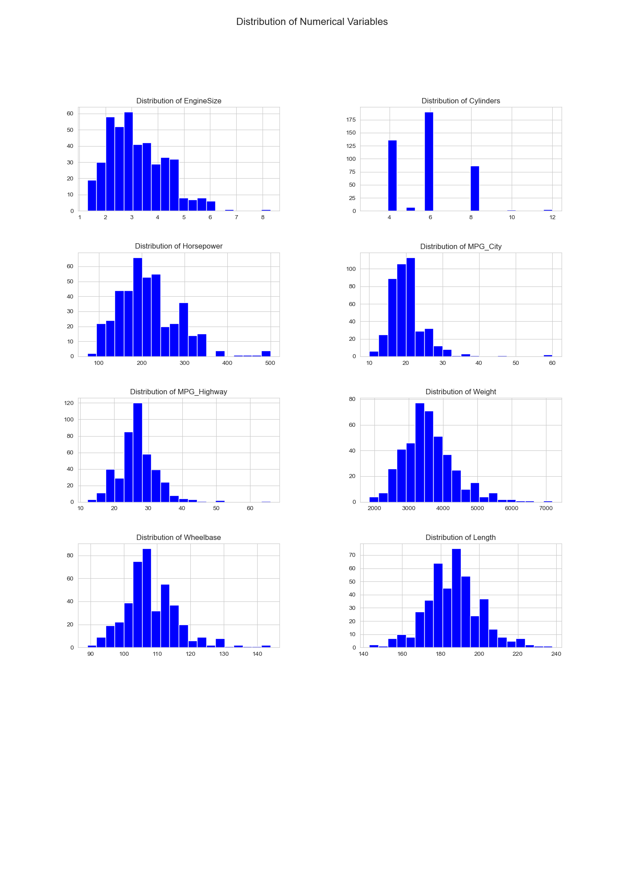
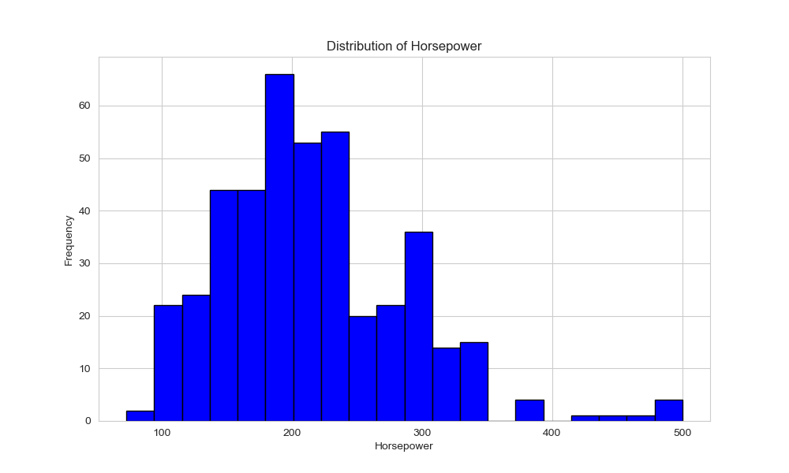
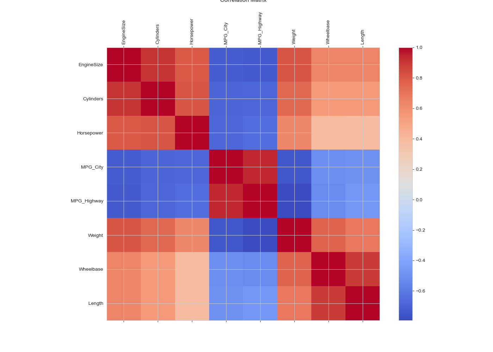
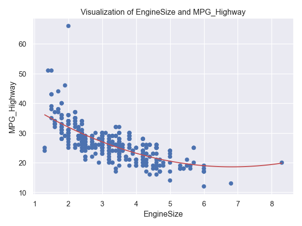

# AfagR_Polars_descriptive_statistics

## Overview
This project is a Python-based assignment that uses **polars** for data analysis and processing. The repository contains a Python script that performs descriptive statistics, visualizations, and data summarization using a dataset of cars.

## Table of Contents
- [Installation](#installation)
- [Usage](#usage)
- [Project Structure](#project-structure)
- [Features](#features)
- [Dependencies](#dependencies)
- [License](#license)

## Installation

### 1. Clone the repository

git clone https://github.com/nogibjj/AfagR_DE_mini_project_polars.git

## Usage 
2. **Create a Virtual Environment**
Activate the virtual environment:
3. **Install Dependencies**
4. **Run the main python file**
5. **Run tests (use Makefile)**

## Makefile Targets
- make install (Install dependencies listed in requirements.txt.)
- make format (Format the code using your preferred formatter (e.g., black).)
- make lint (Lint the code for style and quality issues.)
- make container-lint
- make test (Run unit tests using a testing framework (e.g., pytest).)
- make all (Run all the above targets.)

## Project Structure

## Visualizations of features

## Histogram Horsepower

## Correlation

