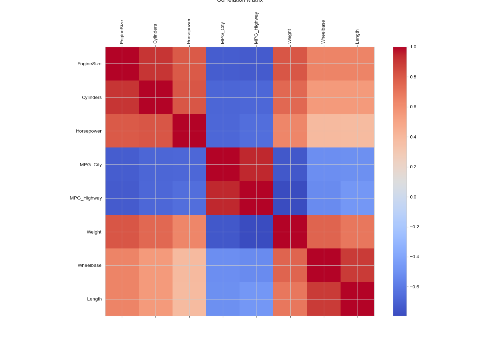

# Summary Statistics Report

## Describe:
| statistic   |   EngineSize |   Cylinders |   Horsepower |   MPG_City |   MPG_Highway |   Weight |   Wheelbase |   Length |
|-------------|--------------|-------------|--------------|------------|---------------|----------|-------------|----------|
| count       |    428       |   426       |      428     |  428       |      428      |  428     |   428       |  428     |
| null_count  |      4       |     6       |        4     |    4       |        4      |    4     |     4       |    4     |
| mean        |      3.19673 |     5.80751 |      215.886 |   20.0607  |       26.8435 | 3577.95  |   108.154   |  186.362 |
| std         |      1.10859 |     1.55844 |       71.836 |    5.23822 |        5.7412 |  758.983 |     8.31181 |   14.358 |
| min         |      1.3     |     3       |       73     |   10       |       12      | 1850     |    89       |  143     |
| 25%         |      2.4     |     4       |      165     |   17       |       24      | 3105     |   103       |  178     |
| 50%         |      3       |     6       |      210     |   19       |       26      | 3476     |   107       |  187     |
| 75%         |      3.9     |     6       |      255     |   21       |       29      | 3977     |   112       |  194     |
| max         |      8.3     |    12       |      500     |   60       |       66      | 7190     |   144       |  238     |

